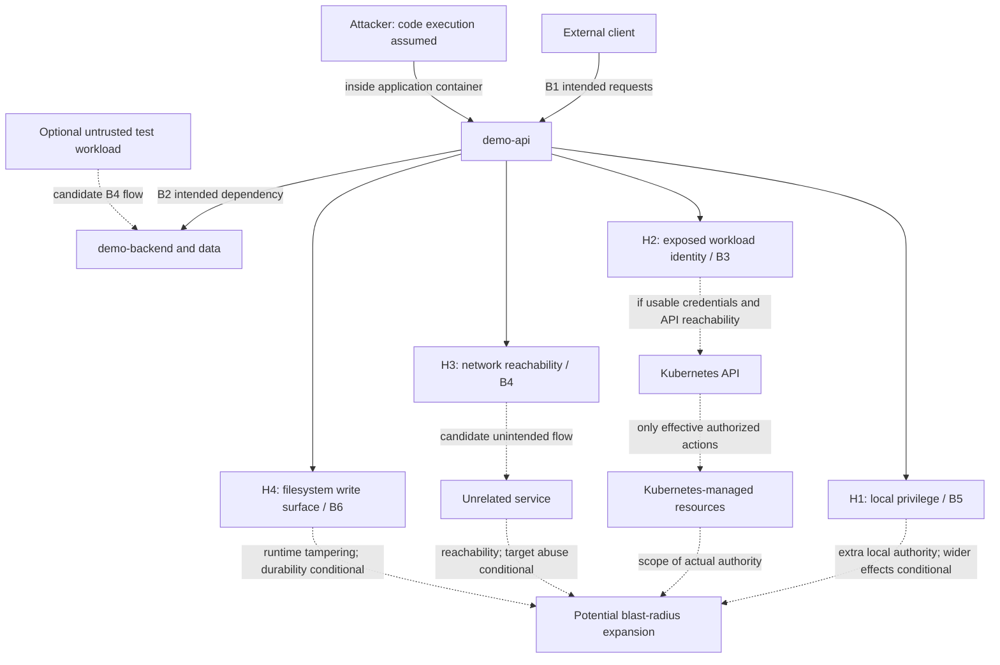

# Task 1 — Security Assessment Frame

Phase A establishes the reasoning for a representative baseline. No workload has been assessed or deployed; no finding is confirmed and every potential control is **PROVISIONAL**.

## 1. Scope

Assess how application workload and Kubernetes manifest choices constrain the blast radius after `demo-api` is compromised. The unit of assessment is the application process, its container/Pod configuration, exposed identities, effective Kubernetes permissions, and relevant application communication paths.

In scope are container privilege and isolation through `securityContext`; ServiceAccounts and workload credentials; Role/ClusterRole and RoleBinding/ClusterRoleBinding permissions; Pod/Service reachability and workload network isolation; filesystem write constraints; and the reasoning needed for later misconfiguration detection, remediation, functionality verification, CI/CD checks, admission enforcement, recurrence prevention, and safe production rollout. This phase stops at evidence plans and provisional controls.

### Sources and provenance

Precedence is: official case-study requirements in the repository → supplied Phase A execution specification → existing repository documentation → general security engineering knowledge.

| Source category | What is established |
| --- | --- |
| Repository evidence | [README](../README.md) identifies workload assessment/hardening and detection/policy enforcement as project themes. At inspection, `docs/` and `task1/` were empty; no official assignment text or prior architecture document was present. |
| Case-study requirements reported by the supplied Phase A specification | Infrastructure may be assumed secure; workload/manifest security is the focus; representative weaknesses may be constructed. Later Task 1 work must identify, analyze, remediate, verify functionality, detect/prevent recurrence, and explain safe production rollout. These statements have not been independently checked against the original assignment. |
| Phase A requirements | Assume code execution inside `demo-api`; frame blast-radius risks; define falsifiable hypotheses before controls; produce only this document. |
| Working assumptions and engineering inference | The assumption register and proposed asset/boundary model below support reasoning; they are not additional assignment requirements. |
| Unresolved implementation decisions | Topology details, application requirements, environment capabilities, and tool choices remain in Section 13. |

Platform hardening is excluded because the supplied case-study context places the assessment above a trusted infrastructure layer. Validating whether a future environment can enforce a workload control is still necessary; securely configured infrastructure does not imply every workload already has least privilege or network isolation. Section 12 explains the remaining exclusions.

## 2. Assumptions

| ID | Assumption or reasoning constraint | Basis and consequence |
| --- | --- | --- |
| A1 | Control plane, worker nodes, underlying network infrastructure, and platform components are securely configured. | Case-study context as reported by the supplied specification. Do not construct a finding from assumed platform misconfiguration. |
| A2 | The attacker initially has arbitrary code execution only inside the `demo-api` application container. | Required threat starting point; exploiting the application is unnecessary. Execution uses the application's actual process identity and constraints. |
| A3 | The attacker initially has no Kubernetes administrator credentials, node access, or control-plane administrative access. | Required starting limitation. Authenticated API use through a workload identity is assessed separately from administrative control. |
| A4 | The attacker can use any credential, identity, filesystem object, network path, or API permission actually exposed to the compromised process. | Working model. Exposure must be established; do not silently give the attacker the assessor's credentials or the ability to create other Pods. |
| A5 | Token exposure becomes an API abuse path only with usable authentication, relevant effective authorization, and API reachability. | Engineering constraint. A token or dedicated ServiceAccount alone does not establish excessive privilege. |
| A6 | Lateral access requires actual connectivity; data access or target compromise additionally depends on target authorization or another weakness. | Engineering constraint. A missing policy alone does not establish a reachable destination. |
| A7 | The future baseline may intentionally include representative workload mistakes in an isolated demonstration environment. | Permission reported by the supplied specification. Exact mistakes and safe fixtures remain Phase B decisions, not existing findings. |
| A8 | A Linux application container and a conceptual `demo-api` → `demo-backend` interaction form the working model. | Linux is needed for the selected privilege questions. Names describe future roles, not deployed services; ports, data, operations, and storage are unresolved. |

No assumption grants root, exploitable capabilities, API permissions, unrestricted networking, persistent storage, or control of another workload. Additional capabilities require evidence.

## 3. Primary Threat Scenario

`demo-api` compromised → attacker executes code as the application → examines available local privilege, workload identity/API authority, reachable destinations, and writable paths → attempts to extend impact beyond the application's intended authority.

The central question is: **which workload controls keep this compromise contained, and which missing constraints allow its blast radius to expand?** Expansion can mean greater local privilege, runtime tampering, additional data/resource access, or access to unrelated services; it does not necessarily mean crossing onto a node.

Application compromise is a starting assumption, not a demonstrated vulnerability. Use this sequence in later work:

Threat → risk hypothesis → representative baseline → observable evidence → confirmed/rejected finding → control → remediation → verification → prevention → operationalization.

Phase A specifies the hypotheses, evidence conditions, and provisional control candidates without executing that sequence. For all later impact claims:

- **Demonstrated:** directly observed configuration or behavior, naming the identity, operation/path, target, and test conditions. An observed setting proves that setting, not every downstream consequence.
- **Possible:** a realistic consequence of an observed condition that has not itself been shown.
- **Conditional:** a consequence requiring an additional permission, exploit, credential, reachable target, or storage/lifecycle condition; name the dependency.

There are currently no demonstrated workload weaknesses. Root inside a container is not evidence of host compromise or cluster takeover.

## 4. Attacker Model

| Capability | Initial state | Evidence or limitation |
| --- | --- | --- |
| Code execution inside `demo-api` | Yes, assumed | Starting point, under the actual application identity. |
| Kubernetes administrator credentials | No | Cannot be supplied implicitly by the test operator. |
| Node access | No | Any later boundary crossing requires separate evidence. |
| Control-plane administrative access | No | Trusted infrastructure assumption; ordinary API authorization is separate. |
| Root inside the container | Unknown | Effective process UID and relevant user mapping must be assessed. |
| Linux capabilities / privileged container mode | Unknown | Inspect effective runtime state and Pod/container configuration. |
| Ability to gain additional local privilege | Unknown | Assess privilege-gain restrictions and prerequisites; a permissive flag is not a successful escalation. |
| ServiceAccount or other credential access | Unknown | Inspect actual process-visible credential sources, without retaining credential contents in evidence. |
| Effective Kubernetes API permissions | Unknown | Evaluate the exposed identity and all applicable grants. |
| API network reachability | Unknown | Keep connectivity, authentication, authorization, and operation results separate. |
| Access to `demo-backend` | Unknown | Intended dependency in the working model; network and application authorization need testing. |
| Access to unrelated workloads/services | Unknown | Test selected paths; do not generalize from one destination. |
| Filesystem write access | Unknown | Assess mounts, ownership, permissions, and process-context writes. |
| Durable persistence after Pod replacement | Unknown | Requires storage/lifecycle evidence beyond a successful container write. |

An auxiliary untrusted workload, if used later, is a separately provisioned negative-test source. Its existence or operation does not imply that the initial attacker can create or control arbitrary Pods.

## 5. Protected Assets

| Asset | Why it matters | Relevant security property |
| --- | --- | --- |
| `demo-api` and its running files/process | The compromised workload is the starting point; extra authority or tampering can deepen impact. | Least local privilege; integrity of the running workload; privilege-boundary preservation. |
| `demo-backend` and backend/application data | Legitimate API access must work without unnecessarily exposing data or operations to other callers. | Confidentiality, integrity, availability. |
| Workload identity and ServiceAccount credentials | A credential can carry authority beyond the application process. | Confidentiality of credentials; least privilege and constrained exposure. |
| Kubernetes API and managed resources | Workload permissions may expose or modify configuration, data, or other workloads. | Authorized access; resource confidentiality, integrity, availability. |
| Other workloads/services | Unrelated services should not inherit the compromised API's incident unnecessarily. | Isolation; confidentiality, integrity, availability. |
| End-to-end application availability | Controls must preserve expected client/API/backend behavior and startup/recovery. | Availability and correct application function. |

## 6. Trust Boundaries

These are engineering boundaries to test, not claims that isolation already exists.

| ID / boundary | What crosses it | Required constraint | Risk if weak |
| --- | --- | --- | --- |
| B1 — External client → `demo-api` | Application requests and responses. | Intended exposure and application authorization; preserve valid requests. | Application/data misuse; initial compromise is already assumed and its exploit is outside this phase. |
| B2 — `demo-api` → `demo-backend` | Backend requests, data, and any application credentials. | Only required connectivity and backend operations. | Compromised API can abuse the access granted to it; backend impact depends on actual authority. |
| B3 — Workload → Kubernetes API | Credentials and API requests. | Only required identity and effective API actions on the required resources/scope. | Unnecessary authorized reads/writes can affect Kubernetes-managed assets. |
| B4 — Workload → unrelated services; untrusted workload → backend | East-west connections outside the intended flow set. | Deny unintended source/destination/protocol/port combinations. | Additional services become reachable attack surfaces; reachability alone does not prove data access or compromise. |
| B5 — Application process → container privilege / host isolation boundary | Local privileged operations and kernel-facing actions. | Minimum local authority and preserved container/host separation. | Additional local power; host impact remains conditional on an enabling exposure or vulnerability. |
| B6 — Application process → container files and mounted storage | File creation, modification, or deletion. | Writes confined to documented application needs. | Runtime integrity loss; persistence depends on the affected storage and lifecycle. |

A Kubernetes namespace is a naming and policy scope, not inherently an enforced security boundary. Introduce multiple namespaces only if the chosen test requires that distinction. Network restrictions on B2 cannot distinguish a legitimate request from a malicious request sent by the same compromised, permitted workload; backend authorization remains relevant.

## 7. Security Objectives

| Objective | Threat addressed | Assets protected | Desired security property | Does not guarantee |
| --- | --- | --- | --- | --- |
| **SO1 — Minimize Local Container Privilege** | Attacker uses unnecessary root execution, Linux capabilities, or privilege-gain opportunities. | `demo-api`; container/host privilege boundary. | The process has only required local authority, with non-root execution and constrained privilege gain where compatible with verified needs. | Elimination of code execution, kernel/runtime vulnerabilities, or all container escape paths. |
| **SO2 — Minimize Workload Identity and Kubernetes API Privilege** | Attacker reuses exposed workload credentials for unnecessary API actions. | Workload identity; managed resources and their data. | Only required credential exposure and permissions, including effective Role/ClusterRole grants and binding scope. | Safety from naming a dedicated ServiceAccount, or prevention of abuse of legitimately authorized operations. |
| **SO3 — Minimize Network Blast Radius** | Attacker reaches unrelated services, or an untrusted workload reaches a protected backend. | Backend/data; other workloads; application availability. | Intended flow allowed and unintended flow denied, while required application traffic continues. | Application authorization, protection from malicious allowed traffic, or proof that a reachable service is exploitable. |
| **SO4 — Limit Filesystem Tampering** | Attacker modifies files outside legitimate application write needs. | Running workload integrity; application availability. | Root filesystem and other nonessential paths resist modification; required writable paths are explicit and narrow. | Prevention of in-memory execution, misuse of permitted writable paths, or all persistence mechanisms. |

A dedicated ServiceAccount can clarify ownership and policy, but SO2 is satisfied by necessary identity plus necessary permissions. SO4 limits runtime tampering; a writable root filesystem does not automatically provide persistence after Pod recreation.

## 8. Initial Risk Hypotheses

**INITIAL RISK HYPOTHESES — NOT YET CONFIRMED**

“Unnecessary,” “excessive,” and “unintended” must be measured against documented legitimate application requirements established in Phase B before evidence is judged.

| Hypothesis | Proposed causal path and objective | Possible impact | Conditional impact / claim limit |
| --- | --- | --- | --- |
| **H1 — Weak Container Isolation** | Code execution + unnecessary effective root/capabilities or missing privilege-gain constraints → additional local authority/opportunity. SO1; B5. | More local operations or a broader opportunity to gain privileges than the application needs. | Successful escalation needs a usable mechanism; host escape needs an additional enabling condition. Root, capabilities, and escalation settings are dimensions of one hypothesis, not three inflated findings. |
| **H2 — Excessive Workload Identity / RBAC** | Code execution + accessible workload identity with unnecessary effective API permissions → authority beyond legitimate application needs. SO2; B3. | Disclosure or modification authorized by Kubernetes but unnecessary for legitimate application behavior, within the identity's effective scope. | An actual API action also requires usable credentials, connectivity, and request acceptance. Token presence alone proves neither useful authority nor cluster compromise. |
| **H3 — Unrestricted East-West Connectivity** | Compromised/untrusted source + an unintended reachable service → expanded network attack surface. SO3; B2/B4. | Interaction with a service outside the intended communication path. | “Unrestricted” is a hypothesis label, not a claim of cluster-wide reachability. Data access or target compromise additionally requires target authority or weakness. One tested flow supports only that flow. |
| **H4 — Unnecessary Filesystem Write Access** | Code execution + writes outside necessary application paths → extra runtime tampering opportunities. SO4; B6. | Altered application files/configuration or additional on-disk payloads for the affected runtime lifetime. | Execution of modified files depends on how the application uses them. Persistence after replacement needs separate storage/lifecycle evidence. |

H1 concerns local authority; H4 concerns the writable integrity surface even for a non-root process. They can interact, but a single observed consequence should not be counted twice. No severity or final finding count is assigned before evidence establishes affected assets and scope.

## 9. Evidence Plan

All activities here are future assessment plans. Manual semantic review and runtime validation are valid detection methods; scanner coverage is supplementary.

Before testing, Phase B must record the legitimate local privilege budget, exact API operations (verb, API group, resource/subresource, name and namespace/cluster scope), intended traffic matrix (source, destination, protocol, port), and required write paths/lifetimes. These may be empty where no need exists, but must not be invented just to justify a tool or finding.

| Hypothesis | Evidence question | Likely evidence | Confirm if | Reject if |
| --- | --- | --- | --- | --- |
| H1 | Does the effective application process have unnecessary local authority or lack the agreed restriction on gaining it? | Manifest and admitted Pod/container security context, including `allowPrivilegeEscalation`; image user; effective UID/groups/capabilities; privileged state; application-process `NoNewPrivs`. | Runtime/configuration evidence shows at least one privilege dimension exceeds the documented need or an agreed privilege-gain restriction is absent. Record the missing safeguard separately from any demonstrated escalation. | All assessed dimensions match the minimum requirement and effective privilege-gain constraints are present. A non-root UID alone, or a failed exploit attempt, cannot reject the whole hypothesis. |
| H2 | Can a process-accessible identity authorize a security-relevant API action beyond the application's needs? | ServiceAccount and all exposed credential sources; applicable Roles/ClusterRoles and bindings, including group grants; exact-action `kubectl auth can-i` or access review; where appropriate, a harmless direct API request against a fixture. | An accessible identity has a security-relevant allowed action beyond the agreed requirement on a specified resource/scope. Label authorization as demonstrated; label execution separately and keep inaccessible API paths conditional. | Credential inventory and authorization review establish no such excess for exposed identities in the assessed scope, or no usable workload credential exists. Record dormant excessive grants separately as conditional; token absence at one path is insufficient. |
| H3 | Can a selected compromised/untrusted source reach a healthy service on a flow outside the intended matrix? | Effective NetworkPolicy inventory/selectors and other applicable filtering; fresh Pod-to-Service connections; source identity/context, destination health, DNS resolution, protocol/port and response results. | A selected unintended connection reaches the actual listener. An HTTP authorization rejection still demonstrates network reachability, but not successful application access. Missing NetworkPolicy alone is insufficient. | Every selected unintended flow is blocked under valid controls while intended flows and target-health controls succeed. Scope rejection to the tested matrix and identify the effective restriction; a timeout by itself is inconclusive. |
| H4 | Can the actual application identity modify a nonessential path on the container filesystem or a mount? | Manifest `readOnlyRootFilesystem`; runtime mount flags/types; ownership/mode and application write requirements; harmless create/modify/delete probes in agreed representative paths. | A harmless write outside documented needs succeeds in the application process context. Identify the affected path and storage type; do not infer durable persistence. | Mount/permission review plus representative denied-write tests support confinement to required paths across the assessed surface. A single denied write or a read-only flag without volume review is insufficient. |

Evidence handling and validity:

- Bind observations to the manifest revision, image digest, admitted configuration, Kubernetes/runtime/network implementation versions, Pod/container, application identity, target, and test time. Defaults and admission mutation may make source YAML differ from effective behavior.
- Keep the assessor's administrative inspection separate from attacker capability. API checks must use workload credentials or an equivalent identity/group context; record any impersonation limitation. `can-i` tests authorization, not whether a subsequent request succeeds. Separate network, authentication, authorization, and admission outcomes. [Kubernetes authorization checks](https://kubernetes.io/docs/reference/access-authn-authz/authorization/#checking-api-access)
- Use controlled data and harmless probes; retain reproducible commands and results without token values or real secrets. Inspect the actual application process, not an unrelated debug container whose privileges may differ.
- Classify incomplete inventories, broken fixtures, DNS failures, and ambiguous denials as **inconclusive**. Rejection is bounded to a documented configuration and test set, never a claim of universal safety. Record absent manifest safeguards separately from runtime exposure.
- For network tests, use fresh connections and verify both applicable source egress and destination ingress restrictions. NetworkPolicy allowances combine across matching policies and require a supporting enforcement implementation. [Kubernetes NetworkPolicy semantics](https://kubernetes.io/docs/concepts/services-networking/network-policies/)
- Distinguish image root filesystem writes from writes to mounted volumes; record whether denial results from read-only mounts or process permissions. Claim persistence only after testing the relevant container restart or Pod replacement against the specific storage type.

Later verification must pair reduced attacker capability with positive functionality evidence: valid client → API → backend response/content, healthy startup/readiness and recovery, required DNS/dependency connections, any legitimate API actions, and writes to required paths. Repeat the same negative/positive cases after remediation; any broken required behavior means the control is not yet acceptable.

## 10. Provisional Control Mapping

**All entries are PROVISIONAL until evidence confirms the associated finding and application requirements are understood. No control is implemented or selected as mandatory.**

| Hypothesis | Desired property | Potential control | Possible implementation and validation dependency |
| --- | --- | --- | --- |
| H1 | Least local privilege. | **PROVISIONAL:** container security constraints. | `securityContext` for non-root execution, disabled privilege escalation, and removal of unnecessary capabilities; assess privileged mode. Verify actual process state and application compatibility. |
| H2 | Necessary identity and API authority only. | **PROVISIONAL:** scoped identity, reduced credential exposure, least-privilege RBAC. | ServiceAccount choice; disable automatic token injection if not needed and review explicit/other credentials; Role/RoleBinding or otherwise justified scope. Review all effective grants rather than just the new binding. |
| H3 | Required network paths only. | **PROVISIONAL:** workload network isolation. | Kubernetes NetworkPolicy with only necessary ingress/egress allowances, including DNS where required. Verify matching selectors, combined rules, and actual enforcement before claiming isolation. |
| H4 | Necessary filesystem writes only. | **PROVISIONAL:** read-only root filesystem and explicitly scoped writable paths. | Container `securityContext` plus appropriate writable mounts only where demonstrated needs require them. Verify mount scope, permissions, lifecycle, and application function. |

Kubernetes security-context controls constrain specific process/filesystem properties; disabling privilege escalation does not remove already-held privileges, and a read-only root filesystem does not make every separately mounted volume read-only. [Kubernetes security contexts](https://kubernetes.io/docs/tasks/configure-pod-container/security-context/)

Disabling automatic token injection addresses that injection mechanism; changing ServiceAccount names does not establish least privilege. Effective authorization and any remaining credentials still need assessment. [Kubernetes ServiceAccounts](https://kubernetes.io/docs/concepts/security/service-accounts/)

Later detection and prevention must follow the confirmed property: evaluate static manifest checks, cross-resource semantic review, and runtime tests for actual coverage. Then evaluate CI/CD gates and admission coverage, including which resource types and relationships a rule can inspect. Pod admission alone must not be presented as proof of effective RBAC or runtime connectivity. A scanner's severity or silence cannot confirm or reject a hypothesis.

Tool selection remains downstream of requirements. Network isolation may require evaluating an appropriate enforcing network implementation, such as Calico, only if the chosen environment lacks that capability. Static detection may justify evaluating Trivy's coverage; neither tool determines the finding set.

Production rollout is a future design constraint: inventory legacy dependencies and violations; begin with observation/audit or warning; measure false positives and functional impact; remediate and enforce on a small cohort; expand only against agreed health/error and policy-rejection thresholds. Plan an owner, rollback criteria, and time-limited exceptions with review/expiry. Exact thresholds, mechanism, and cohort are unresolved; this is provisional operational reasoning, not a rollout configuration.

## 11. Threat Model Diagram

Solid client/API/backend arrows show intended conceptual traffic; the attacker arrow marks assumed code execution. Solid API → H1–H4 arrows identify assessment dimensions. Dashed arrows show candidate paths or consequences requiring evidence. No edge asserts observed connectivity; the untrusted source is an optional test fixture.

## 12. Out of Scope

| Exclusion | Reason for boundary |
| --- | --- |
| Control-plane and etcd hardening; worker-node OS and kubelet hardening; Kubernetes PKI; control-plane HA; platform-component hardening. | Infrastructure is treated as securely configured under the supplied case-study context. Workload-granted API authority is still in scope; control-plane takeover is not assumed. |
| Infrastructure-level network/CNI hardening or production network redesign. | The question is application traffic isolation. Later proof of policy-enforcement capability is a prerequisite check, not a platform-hardening assessment. |
| Initial application exploit development; kernel/container-escape exploit development. | Code execution is already assumed. Additional vulnerabilities must not be invented to inflate workload impact. |
| Full SOC implementation or full runtime detection platform. | Task 1 needs focused detection/prevention evidence; building enterprise security operations would exceed this workload frame. |
| Task 2 and enterprise-wide asset/access architecture. | Separate assignment scope; unnecessary to assess this small workload threat model. |
| This run: application code, Kubernetes manifests, Docker/Compose, tool installation/configuration, CI/CD changes, deployment, production changes, branches, commits, or pushes. | Phase A authorizes only `docs/architecture.md`; implementation and execution belong to later phases. |

## 13. Open Questions Before Baseline Implementation

These are Phase B design inputs, not unanswered claims about an existing workload.

| Question | Why it matters / when to resolve |
| --- | --- |
| Where is the original official Task 1 assignment, and does it add constraints absent from the supplied context? | Reconcile source precedence when available. The supplied specification is sufficient for this frame; any conflicting official scope must be resolved before baseline implementation. |
| Does `demo-api` legitimately require Kubernetes API access? If so, which exact verbs, resources/subresources, names, and scopes? Which harmless fixture can show excess? | Define the SO2 permission budget before selecting representative grants or judging H2. An application requiring no API resource access is an option, not an assumption. |
| What legitimate client/backend behavior, ports, protocols, authorization, data, startup/recovery behavior, and local privileges must the application support? | Establish the functional contract and minimum privilege budget before baseline configuration and H1 evaluation. |
| Which writable paths are required, by which identity, and for what lifecycle? | Decide whether any explicit writable volume is needed and which nonessential paths can safely test H4. |
| Which unintended flow best represents expansion from compromised `demo-api`, and would a separate untrusted-source → backend check add useful evidence? Is a namespace distinction necessary? | Select a small topology and observable negative traffic matrix for H3; do not assume control of other workloads or create namespace boundaries for appearance. |
| Which Kubernetes/runtime/network implementation will the isolated baseline use, and will existing admission settings permit the representative mistakes? Does it enforce the required NetworkPolicy semantics? | Establish a viable test environment before deployment. Do not weaken production controls; decide whether an alternative isolated environment is needed. Calico is only a candidate if enforcement capability is missing. |
| Which static checks, including possible Trivy coverage, detect each confirmed property, and where will semantic/runtime evidence or different admission resource coverage be necessary? | Evaluate against the eventual fixtures; select CI/CD/admission mechanisms after confirmation, without dropping risks a scanner misses. |
| Which legacy workloads, owners, availability/error budgets, warning period, rollback triggers, and exception lifetimes would govern production enforcement? | Required before later rollout design; does not block a representative baseline. |

### Phase A exit review

Scope/exclusions and source limitations are explicit; infrastructure and attacker assumptions are separated from evidence; assets and boundaries are identified. SO1–SO4 map to distinct H1–H4, each with an evidence question and bounded confirmation/rejection conditions. Possible and conditional consequences are separated from observations; all controls remain provisional. The evidence plan requires both security improvement and preserved functionality, and no tool determines the risks.

Only this document was created. No implementation or workload tests were performed. The questions above can be answered through Phase B design and bounded experimentation; none prevents designing the representative baseline from the supplied specification. Findings remain unconfirmed.

**PHASE A READY FOR BASELINE DESIGN**
