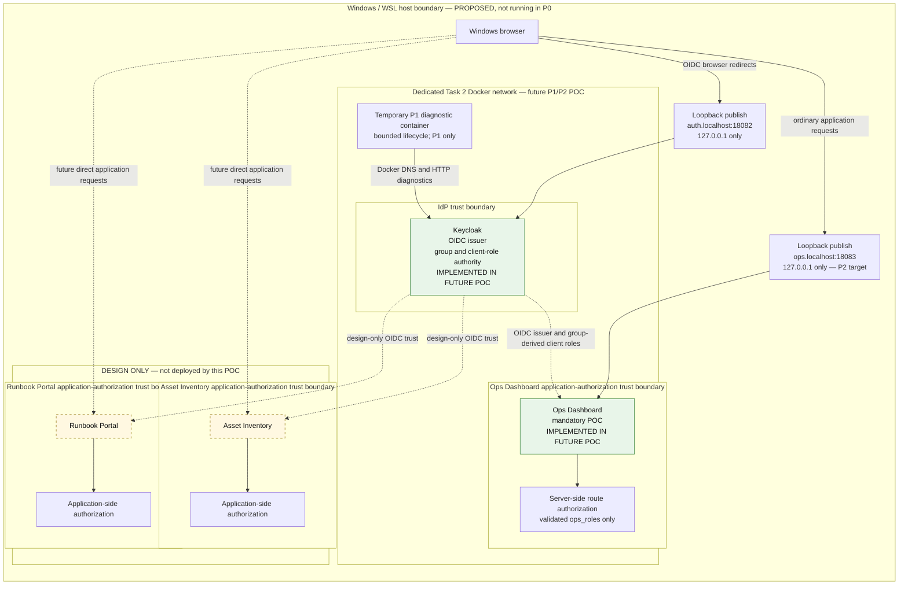

# Task 2 P0 architecture — centralized IAM/SSO

## Scope and phase boundary

The selected assignment option is **Option A (IAM/SSO)**. The target design has
three internal applications, with only the Ops Dashboard implemented in the
mandatory POC:

| Application | P0/P1 status | OIDC client | Application roles |
|---|---|---|---|
| Ops Dashboard | Mandatory POC | `ops-dashboard` | `viewer`, `admin` |
| Asset Inventory | Design only | `asset-inventory` | `viewer`, `editor` |
| Runbook Portal | Design only | `runbook-portal` | `reader`, `publisher` |

Keycloak centrally owns users, groups, client roles, and group-to-role
mappings. Each application still enforces its own small role vocabulary after
validating a token intended for that client. Client roles are preferred over
realm-wide application roles: they prevent an identically named permission in
one application from silently authorizing another.

P0 is only a read-only host preflight and a set of implementation decisions. A
successful P0 does **not** show that the Docker daemon works, that containers
can communicate, that a Windows browser can reach the services, that a realm
exists, or that OIDC works.

## Logical architecture

This is the **proposed** P1/P2 shape; it is not a claim that any service is
running in P0. Browser requests go directly to each application. Keycloak is
the identity, group, and client-role authority, but it does not proxy ordinary
application requests. Each application owns its authorization decisions.



## Selected stack and versions

| Component | Selected version | Decision |
|---|---:|---|
| Keycloak | `26.7.4` | Official `quay.io/keycloak/keycloak:26.7.4` image; dev mode and its embedded database are acceptable only for this local POC. |
| Python container | `3.12.14-slim-bookworm` | Official Python image; explicit patch and Debian variant. |
| Flask | `3.1.3` | Minimal server-side web application and signed-cookie session. |
| Authlib | `1.7.2` | OIDC relying-party integration; P2 must test its actual validation behavior rather than assume it. |
| Gunicorn | `26.2.2` | Bind to the container interface; do not use Flask's development server as the POC server. |
| Docker Compose | Compose Specification via `docker compose` | Use the installed plugin only after P1 proves daemon feasibility. |

The versions were checked against primary release sources on 2026-09-23:
[Keycloak 26.7.4](https://www.keycloak.org/2026/09/keycloak-2674-released),
[Python 3.12.14 and its official image tag](https://github.com/docker-library/official-images/blob/master/library/python),
[Flask 3.1.3](https://flask.palletsprojects.com/en/stable/changes/),
[Authlib 1.7.2](https://github.com/authlib/authlib/releases), and
[Gunicorn 26.2.2](https://gunicorn.org/news/). P1 must resolve image tags to
immutable multi-architecture digests and record the selected platform before
first use; P0 did not pull images.

## IdP alternatives and selection

All three candidates document OIDC capability. The configuration-complexity
and case-study-fit statements below are project-specific engineering judgments,
not product capability claims or a universal ranking.

| Criterion | Keycloak | Authentik | ZITADEL |
|---|---|---|---|
| OIDC support | OIDC provider, discovery, clients, scopes, and protocol mappers are documented. | OAuth2/OIDC provider supports authorization code, PKCE, discovery, JWKS, and scope mappings. | OIDC applications, discovery/token claims, and project role claims are documented. |
| Group and role modeling | Groups inherit role mappings; realm and client roles are distinct. | Hierarchical groups and inherited roles are documented. | Project roles and user grants are documented. A first-class user-group collection equivalent was not verified in the reviewed documentation: **UNVERIFIED**. |
| Application-specific authorization | Client roles provide a native per-client namespace and role-scope mappings can limit token roles. | Application bindings and a per-application provider/policy model can gate access; exact application role claims require a project-defined mapping. | Roles are scoped to a project and shared by its applications; separate projects can provide separate security contexts. |
| Token-claim mapping | Protocol mappers can place a selected client's roles in a named ID-token claim. | Python-expression scope mappings can return custom claims. | Standard project-role claims can be included in ID tokens; Actions can add custom claims. |
| Local reproducibility | Official one-container `start-dev` example uses the development database and is the smallest fit for this bounded POC. | Official Compose path is reproducible but requires PostgreSQL and the Authentik services. | Official Compose path is reproducible but includes a proxy, API, login service, PostgreSQL, and an initialization job. |
| Operational dependencies | One Keycloak container is sufficient only for this local dev-mode POC; production needs an external database and hardened startup. | PostgreSQL is required; the official small-install guidance specifies at least 2 CPU cores and 2 GB RAM. | PostgreSQL and HTTP/2-capable proxy behavior are explicit self-hosting considerations. |
| Configuration complexity for this POC | Native group → client-role → dedicated claim controls align directly with the selected `ops_roles` contract. | Flexible mappings and policies can meet the design, but add expression and provider configuration for the exact claim contract. | Project roles fit application authorization, but the selected group-based model and exact top-level claim would need adaptation and additional verification. |
| Relevant production expansion | Federation, external databases, clustering, delegated administration, and broader protocol support are documented expansion paths. | Multiple provider types, policy/flow composition, and group/application bindings support broader access patterns. | Organizations, project grants, stateless service scaling, and delegated B2B role administration are strong expansion paths. |

Official sources reviewed:

- Keycloak: [Server Administration Guide](https://www.keycloak.org/docs/latest/server_admin/),
  [protocol-mapper reference](https://www.keycloak.org/admin-api/protocol-mappers),
  and [Docker getting started](https://www.keycloak.org/getting-started/getting-started-docker).
- Authentik: [OAuth2/OIDC provider](https://docs.goauthentik.io/add-secure-apps/providers/oauth2),
  [groups](https://docs.goauthentik.io/users-sources/groups/manage_groups),
  [Docker Compose installation](https://docs.goauthentik.io/install-config/install/docker-compose),
  and [configuration](https://docs.goauthentik.io/install-config/configuration/).
- ZITADEL: [projects, applications, and roles](https://zitadel.com/docs/guides/manage/console/projects-overview),
  [claims](https://zitadel.com/docs/apis/openidoauth/claims),
  [Docker Compose deployment](https://zitadel.com/docs/self-hosting/deploy/compose),
  and [self-hosting requirements](https://zitadel.com/docs/self-hosting/manage/requirements).

Keycloak is selected for this case study because its native client-role
namespace, group-to-role inheritance, role-scope controls, and client-role
protocol mapper match the exact authorization contract with the fewest local
POC dependencies. Authentik and ZITADEL are credible alternatives; a different
group model, claim contract, operating environment, or production roadmap
could reasonably favor either one.

## P0 host observations

These commands were read-only. They were captured at `2026-09-23T07:42:56Z` in
WSL2; they are observations, not future availability guarantees.

| Check | Observation | P0 result and limit |
|---|---|---|
| Host | Linux `5.15.167.4-microsoft-standard-WSL2`, x86_64 | WSL2 confirmed. |
| Git | `/usr/bin/git`, `2.43.0` | Available; the version is represented in the [official Git documentation](https://git-scm.com/docs/git/2.43.0). |
| Python | `/usr/bin/python3`, `3.12.3` | Available; it is an [official Python release](https://www.python.org/downloads/release/python-3123/) but is superseded. The POC uses the selected container patch instead. |
| Docker CLI | `/usr/bin/docker`, `29.3.0` | Available and present in the [official release notes](https://docs.docker.com/engine/release-notes/29/). The daemon was deliberately not queried. |
| Compose CLI | `docker compose`, `v5.1.0` | Available and represented in the [official Docker Desktop release notes](https://docs.docker.com/desktop/release-notes/). No Compose model was created or run. |
| WSL listeners | No TCP listener on `18082` or `18083` | Free in WSL at the observation time only; this says nothing about Windows reservations or exposure. |
| WSL name resolution | `localhost` returned `127.0.0.1`; `auth.localhost` and `ops.localhost` returned no result | The selected names require P1 verification. No hosts or resolver file was changed. |
| Windows observations | `powershell.exe` was on the mounted Windows path, but WSL interop was unavailable | Windows name resolution, listeners, browser reachability, and external exposure are **UNVERIFIED**. |

No Windows firewall, WSL networking, Docker daemon setting, or hosts file was
readjusted. P1 owns every runtime check.

## Fixed network and hostname contract

The canonical names deliberately use the special-use `.localhost` suffix. P1
must verify actual behavior in the chosen Windows browser; the standard's
special treatment is not accepted as evidence by itself. The WSL resolver's P0
failure is explicit, so WSL command-line probes may use `curl --resolve` to test
the route and Host header, but that does not count as DNS resolution.

| Consumer | Keycloak address | Flask address |
|---|---|---|
| Windows browser | `http://auth.localhost:18082` | `http://ops.localhost:18083` |
| WSL reachability probe | canonical URL with explicit `--resolve ...:127.0.0.1` if ordinary resolution still fails | same |
| Flask container | `http://auth.localhost:18082` through the Compose DNS alias | `http://0.0.0.0:18083` is its listen address, not an issuer or browser URL |
| Keycloak container | `http://0.0.0.0:18082` listen address | reaches Flask only through the isolated network if a future tested feature requires it |

The issuer is fixed as:

```text
http://auth.localhost:18082/realms/ops
```

Keycloak must receive a full `KC_HOSTNAME` of
`http://auth.localhost:18082`; dynamic backchannel hostnames stay disabled.
The Keycloak service has the `auth.localhost` alias on the private Compose
network so that browser and application use the identical scheme, host, port,
and issuer string. P1 checkpoint 2 must compare this value byte-for-byte with
the discovery document's `issuer`. Keycloak documents why its configured base
URL affects discovery and tokens in its [hostname guide](https://www.keycloak.org/server/hostname).

The P1 Compose model must use a unique project name (`task2-iam`) and an
explicit, dedicated bridge network (`task2-iam-oidc`). It must not attach to,
inspect through, recreate, stop, or remove Task 1 containers, networks, or
volumes. Only these host mappings are allowed:

```yaml
keycloak: 127.0.0.1:18082:18082
app:      127.0.0.1:18083:18083
```

Both processes listen on `0.0.0.0` **inside** their containers; container
loopback would prevent the port mapping from reaching them. Host isolation
comes from the explicit `127.0.0.1` publish address, not from an in-container
`localhost` assumption. Docker notes that an omitted host IP publishes more
broadly, while a loopback IP restricts access to the Docker host
([port-publishing guidance](https://docs.docker.com/engine/network/port-publishing/)).
P1 must still verify Windows-side behavior and unintended LAN exposure rather
than infer it from Compose or WSL `ss` output.

Keycloak's administration console shares the loopback-only Keycloak endpoint;
no admin or management port is separately published. Bootstrap credentials and
the OIDC client secret come from ignored environment files or runtime secrets,
never tracked configuration. The POC uses HTTP only on local loopback. A real
deployment requires TLS, a production database, a hardened Keycloak start
mode, backup/recovery, monitoring, and a separately controlled administration
path.

## OIDC flow and validation contract

The Ops Dashboard is a confidential OIDC client with standard authorization
code flow enabled. Implicit flow, direct-access password grants, service
accounts, and wildcard redirect URIs are disabled. The only redirect URI is:

```text
http://ops.localhost:18083/oidc/callback
```

The login request uses `scope=openid profile` plus a high-entropy, one-time
`state`, `nonce`, and PKCE `S256` challenge. The callback rejects any missing,
mismatched, reused, or expired state/nonce before creating an application
session, exchanges the one-time code at the discovered token endpoint using
client authentication, and verifies PKCE.

```mermaid
sequenceDiagram
  autonumber
  participant Browser as Windows browser
  participant Flask as Flask Ops Dashboard
  participant Keycloak as Keycloak IdP

  Browser->>Flask: GET http://ops.localhost:18083/protected
  Flask->>Flask: Create one-time state, nonce, and PKCE verifier
  Flask-->>Browser: 302 to Keycloak authorization endpoint with S256 challenge
  Browser->>Keycloak: Authorization request
  Keycloak->>Keycloak: Authenticate user and resolve group/client roles
  Keycloak-->>Browser: 302 callback with authorization code and state
  Browser->>Flask: GET /oidc/callback?code=...&state=...
  Flask->>Flask: Validate and consume state; load bound nonce and verifier
  Flask->>Keycloak: Back-channel code exchange with PKCE and confidential-client authentication
  Keycloak-->>Flask: ID token and access token
  Flask->>Flask: Validate ID token with Authlib/OIDC primitives, including nonce
  Flask->>Flask: Extract and validate dedicated ops_roles claim
  Flask->>Flask: Create signed, absolute ten-minute application session
  Browser->>Flask: Request protected route with session cookie
  Flask->>Flask: Enforce required normalized role server-side
  alt Required role is present
    Flask-->>Browser: Authorized response
  else Required role is absent
    Flask-->>Browser: HTTP 403
  end
```

The confidential-client token request is a Flask-to-Keycloak back-channel
operation. The browser never receives the client secret and never performs the
token exchange.

Before trusting identity or roles, P2 must use discovery and the advertised
JWKS to validate the ID token:

1. accept only an expected asymmetric signing algorithm advertised by the
   provider (initially `RS256`), never `none` or a caller-supplied key URL;
2. verify the signature against the discovery `jwks_uri`, refresh a bounded
   cache once for a previously unseen `kid`, and fail closed if no valid key is
   found;
3. require exact `iss` equality with the fixed issuer; accept `aud` only as the
   single string `ops-dashboard` or an array containing exactly that one value;
   reject missing, different, empty, or multiple-audience values; and, if
   `azp` is present, require it to equal `ops-dashboard`;
4. validate `exp`, `iat`, and `nbf` when present with at most 60 seconds of clock
   skew, plus the one-time callback `nonce`;
5. require a non-empty string `sub`; treat `preferred_username` only as display
   text; and validate the role claim using the exact schema below.

The exact single-audience rule is this bounded application's acceptance policy,
not a claim that OIDC universally forbids multiple-audience ID tokens.

P2 must use supported Authlib/OIDC primitives for standard discovery, state,
nonce, signature, issuer, audience, time-claim, and other protocol validation
wherever the selected version provides them. Application-specific code owns the
exact audience policy above, the `ops_roles` schema and normalization, rejection
of unrelated client roles, session construction, route authorization, and only
narrowly identified library gaps. It must not become a custom general-purpose
JWT or OIDC validation framework. P2 must confirm the actual behavior of
Authlib `1.7.2` through its documentation and observed positive and negative
tests; library behavior must not be assumed.

These checks follow the [OIDC Core ID-token validation
contract](https://openid.net/specs/openid-connect-core-1_0.html#IDTokenValidation).
ID-token audience means this relying party is an intended recipient. It is not
an access-token resource audience and is not used as a substitute for API
authorization. The POC makes no downstream bearer-token call, so it discards
the access token after the callback and never places it in the Flask session.

## Authoritative Ops Dashboard role claim

There is exactly one authorization source for this POC: the `ops_roles` claim
from the **successfully validated ID token**.

```json
{
  "ops_roles": ["viewer", "admin"]
}
```

The claim must be a JSON array of unique strings. The only recognized values
are `viewer` and `admin`; unknown values are dropped and a missing, scalar, or
otherwise malformed claim yields no roles. The application ignores
`realm_access`, every `resource_access` entry, group claims, UserInfo roles,
headers, query strings, form fields, and client-side state for authorization.

Keycloak `26.7.4` must configure an OIDC client scope named
`ops-dashboard-roles`, attached as a **default** scope only to
`ops-dashboard`. It contains this mapper:

| Mapper setting | Exact value |
|---|---|
| Mapper type / provider ID | User Client Role / `oidc-usermodel-client-role-mapper` |
| Client ID | `ops-dashboard` (must not be blank) |
| Token claim name | `ops_roles` |
| Claim JSON type | `String` |
| Multivalued | `true` |
| Add to ID token | `true` |
| Add to access token | `false` |
| Add to lightweight access token | `false` |
| Add to UserInfo | `false` |
| Add to token introspection | `false` |

The [Keycloak protocol-mapper reference](https://www.keycloak.org/admin-api/protocol-mappers)
states that setting Client ID restricts this mapper to roles of that client;
leaving it blank would include roles from all clients. `Full Scope Allowed` is
off. The dedicated scope's role-scope mappings allow only the two
`ops-dashboard` roles, and the generic built-in `roles` scope is not attached
to this client. P1/P2 must use Keycloak's client-scope evaluation and an actual
ID token to prove the mapper emits only the expected array on version `26.7.4`.
Configuration is not evidence of output.

Group membership produces client roles as follows:

| Keycloak group | Assigned client roles | POC authorization effect |
|---|---|---|
| `/ops-viewers` | `ops-dashboard:viewer` | May read the dashboard; denied the admin view. |
| `/ops-admins` | `ops-dashboard:viewer`, `ops-dashboard:admin` | May read dashboard and admin view. Roles are explicit, not implied in application code. |
| `/asset-inventory-viewers` | `asset-inventory:viewer` | No Ops Dashboard authorization. |
| `/runbook-publishers` | `runbook-portal:reader`, `runbook-portal:publisher` | No Ops Dashboard authorization. |

Users inherit role mappings from their Keycloak groups. No POC user receives
an Ops Dashboard role directly. This keeps access review centered on group
membership while preserving client-specific permissions; Keycloak documents
both group inheritance and token role scoping in its [server administration
guide](https://www.keycloak.org/docs/latest/server_admin/#_role_mappings).

## Application-session contract

After all callback validation succeeds, Flask rotates/clears the pre-login
session and creates a short-lived signed cookie containing only:

```json
{
  "sub": "validated Keycloak subject",
  "display_name": "escaped display-only value",
  "ops_roles": ["normalized", "validated roles"],
  "auth_time": 1790000000,
  "csrf": "32-byte random value"
}
```

`display_name` is not an identifier and never authorizes. `auth_time` is copied
only if it is a validated integer. The cookie never contains an ID token,
access token, refresh token, authorization code, client secret, password, or
unfiltered token payload. Flask's default cookie is signed, **not encrypted**,
so even these fields are treated as browser-visible.

Configuration is fixed to a high-entropy runtime `SECRET_KEY`, host-only cookie
(`SESSION_COOKIE_DOMAIN` unset), `HttpOnly`, `SameSite=Lax`, path `/`, a unique
name, `PERMANENT_SESSION_LIFETIME=600`,
`SESSION_REFRESH_EACH_REQUEST=false`, and `session.permanent=true`.
`Secure=false` is a documented local-HTTP exception; any TLS deployment must
set it to `true`. Flask documents both the cookie flags and timestamp validation
for permanent signed sessions in its [security guidance](https://flask.palletsprojects.com/en/stable/web-security/#set-cookie-options).

Every protected request trusts only the valid signed cookie and checks the
required normalized role. The POC performs no mid-session Keycloak lookup:
cached roles can therefore remain stale for at most ten minutes. Removing a
user from a group, disabling the user, ending the Keycloak session, or changing
a role does **not** immediately revoke an already issued Flask session. Roles
are revalidated only on the next OIDC login after local logout or expiry. A
production design requiring immediate revocation must replace this model with
a server-side session store plus back-channel logout/introspection or another
tested revocation signal.

`POST /logout` is the only logout route. It requires the session CSRF value in
a form body, constant-time comparison, and an allowed same-origin `Origin` (or
strict `Referer` fallback); it then clears the local Flask session. There is no
`GET /logout`. This is **application-session logout only**: it neither invokes
Keycloak's end-session endpoint nor promises single/global logout. Keycloak SSO
may therefore sign the user straight back in. Any future state-changing admin
route must also be POST/PUT/PATCH/DELETE as appropriate, require CSRF protection,
and re-check the `admin` role server-side.

## Mandatory P1 gates and unresolved prerequisites

### Checkpoint 1 — before realm provisioning

P1 must fail closed until all of the following are recorded:

- the Docker daemon and Compose model are usable without altering Task 1;
- resolved image digests and expected platforms match the selected versions;
- the Compose resource names and network are isolated from Task 1;
- Keycloak starts on the dedicated Task 2 network;
- a temporary diagnostic container owned by the `task2-iam` Compose project
  resolves `auth.localhost` to Keycloak and reaches its intended HTTP endpoint;
- that diagnostic resource has an explicit bounded lifecycle and Task 2 cleanup
  ownership, with no attachment to or cleanup of Task 1 resources;
- WSL reaches the loopback-published Keycloak endpoint, with explicit name
  override if needed, and the actual `18082` host listener is loopback only;
- a Windows browser reaches `http://auth.localhost:18082`, Windows-side
  listeners are observed, and a second LAN host or equivalent Windows-side test
  cannot reach the Keycloak endpoint; and
- intended Flask port `18083` has no detected conflict where the environment
  permits checking it. No listener or HTTP response on `18083` is required in
  P1 because Flask is a P2 implementation target.

General Internet egress denial is **OPTIONAL HARDENING**, not a P1 IAM/SSO
acceptance condition. If `internal: true` or another egress restriction is
proposed, test it separately and do not allow it to break the mandatory Docker
DNS, Keycloak, discovery, JWKS, or browser paths. The dedicated network,
intended membership, Task 1 separation, and loopback-only host publish remain
mandatory.

P0 cannot supply the Windows results; they remain **UNVERIFIED**. A WSL-only
socket check cannot pass this checkpoint.

### Checkpoint 2 — after minimal realm provisioning

Before P2 implements the Flask callback, P1 must retrieve
`http://auth.localhost:18082/realms/ops/.well-known/openid-configuration` from
an authorized Task-2-owned diagnostic container and the host path and prove:

- `issuer` is exactly `http://auth.localhost:18082/realms/ops`;
- authorization, token, JWKS, and (if advertised) end-session endpoints use the
  selected hostname consistently and are reachable by their intended caller;
- `jwks_uri` returns usable signing keys and expected algorithm metadata;
- exact redirect URI, code flow, PKCE, client authentication, and disabled
  grants match this document;
- the intended client, client scopes, role mapper, groups, client roles, and
  group-to-role mappings match this document.

Configuration inspection records the mapper as **CONFIGURED**; it does not
prove emitted token content. P1 may verify a real issued ID token only through
a separate, bounded OIDC test client that is expressly included in the future
P1 implementation scope and uses an appropriate interactive flow. P1 must not
enable direct-access password grants merely to simplify testing. If that client
is not included, actual `ops_roles` output remains **UNVERIFIED** and P2 must
validate a real issued ID token—including exact shape and unrelated-role
exclusion—before accepting the RBAC integration.

Until a realm exists, the issuer and mapper are design values—not verified
OIDC facts. Detailed pass/fail evidence belongs to [test-plan.md](test-plan.md).

Unresolved at P0: Docker daemon state, image digests/platform, actual Compose
network behavior, `.localhost` behavior in the Windows browser, Windows port
availability and exposure, realm import compatibility with Keycloak `26.7.4`,
actual mapper output, discovery/JWKS content, Authlib callback behavior, and all
end-to-end sessions.
